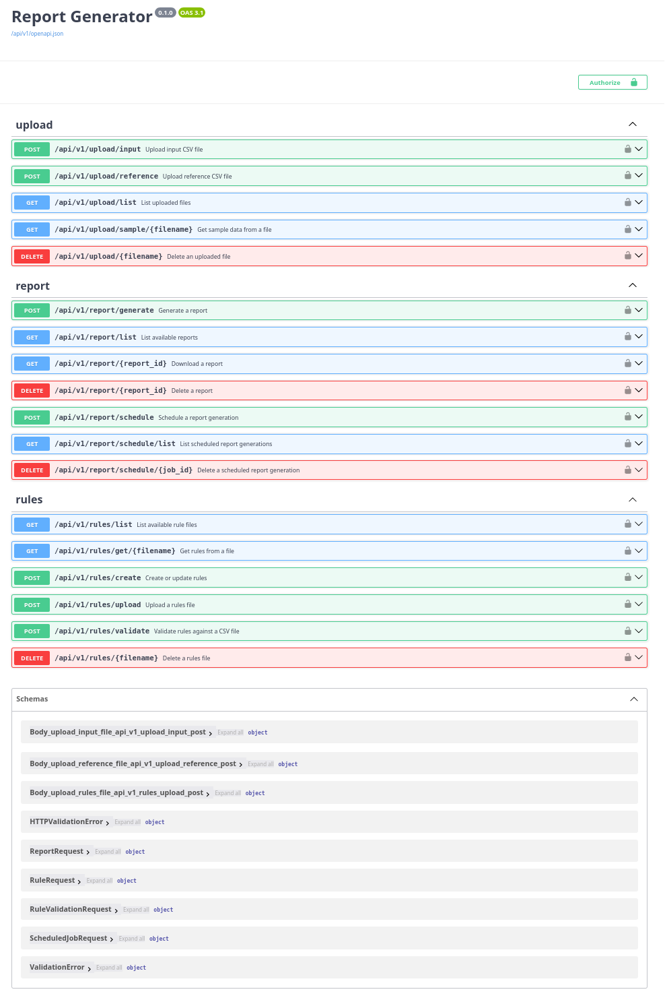

# Report Generator Microservice

A high-performance microservice for transforming CSV data and generating reports.

## Features

-   **CSV Processing**: Chunk-based reading/joining for large files (`pandas.read_csv` with `chunksize`, `pandas.merge`).
-   **Rule Transformations**: Apply custom rules (JSON/YAML) using expressions evaluated on Pandas DataFrames (`RuleEngine`, leveraging `pandas.eval` context).
-   **Output**: Generate reports in CSV, XLSX, JSON.
-   **Scheduling**: Schedule report generation via cron expressions (`APScheduler`, `SQLAlchemyJobStore`).
-   **API Security**: API Key authentication (`X-API-Key` header).
-   **Performance**: Multiprocessing for parallel rule application on chunks (`concurrent.futures.ProcessPoolExecutor`).

## Setup

# API available at `http://localhost:8000/api/v1/docs`. Default API Key: `dev_api_key`.

### Using Docker Compose (Recommended)

*   **Prerequisites:** Docker, Docker Compose.
*   **Clone:** `git clone git@github.com:anujrmohite/ubiquitous-octo-fishstick.git`
*   **Create Data Directories:** `mkdir -p data/uploads data/reports data/rules app_data`
*   **Build Image:** `docker build -t report-generator .`
*   **Create `docker-compose.yml`:** (A `docker-compose.yml` file defining the service and volumes is required - not provided in snippets).
*   **Start:** `docker-compose up -d`

API available at `http://localhost:8000/api/v1/docs`. Default API Key: `dev_api_key` (use in `X-API-Key` header).

### Manual Setup

*   **Prerequisites:** Python 3.9+, pip.
*   **Clone:** `git clone git@github.com:anujrmohite/ubiquitous-octo-fishstick.git`
*   **Virtual Env:** `python -m venv venv && source venv/bin/activate`
*   **Install Deps:** Ensure `requirements.txt` is present (`fastapi`, `uvicorn`, `pandas`, `numpy`, `PyYAML`, `SQLAlchemy`, `APScheduler`, `pydantic`, `python-multipart`, `openpyxl`). Then run `pip install -r requirements.txt`.
*   **Create Data Directories:** `mkdir -p data/uploads data/reports data/rules app/data/reports`
*   **Run:** `uvicorn app.main:app --host 0.0.0.0 --port 8000`

## API Endpoints

(Authentication via `X-API-Key: dev_api_key` required for all)

*   `POST /api/v1/upload/input` - Upload input CSV.
*   `POST /api/v1/upload/reference` - Upload reference CSV.
*   `GET /api/v1/upload/list` - List uploaded files.
*   `GET /api/v1/upload/sample/{filename}` - Sample data from file.
*   `DELETE /api/v1/upload/{filename}` - Delete uploaded file.

*   `GET /api/v1/rules/list` - List rule files.
*   `GET /api/v1/rules/get/{filename}` - Get rule file content.
*   `POST /api/v1/rules/create` - Create/update rules file from payload.
*   `POST /api/v1/rules/upload` - Upload rules file.
*   `POST /api/v1/rules/validate` - Validate rules against files.
*   `DELETE /api/v1/rules/{filename}` - Delete rules file.

*   `POST /api/v1/report/generate` - Generate report (background task).
*   `GET /api/v1/report/list` - List generated reports.
*   `GET /api/v1/report/{report_id}` - Download report.
*   `DELETE /api/v1/report/{report_id}` - Delete report.
*   `POST /api/v1/report/schedule` - Schedule report job.
*   `GET /api/v1/report/schedule/list` - List scheduled jobs.
*   `DELETE /api/v1/report/schedule/{job_id}` - Delete scheduled job.

## Implementation Details (Code Structure)

*   **`app/main.py`**: FastAPI app entry point, includes routers, initializes scheduler.
*   **`app/core/config.py`**: Settings loading (env vars, defaults), defines paths (`UPLOAD_FOLDER`, `REPORT_FOLDER`, `RULES_FOLDER`), DB URI for scheduler.
*   **`app/core/security.py`**: API Key dependency (`get_api_key`).
*   **`app/schemas/schemas.py`**: Pydantic models for request/response/data structures.
*   **`app/services/parser.py`**: `CSVParser` handles file validation, column listing, and chunked reading/joining (`process_in_chunks`).
*   **`app/services/transformer.py`**: `RuleEngine` loads rules, applies expressions to DataFrames (`apply_rules` using controlled `eval` context), and validates rules syntax against columns (`validate_rules`).
*   **`app/services/report_generator.py`**: `ReportGenerator` orchestrates report creation (uses `CSVParser` for data, `RuleEngine` for transformations, `ProcessPoolExecutor` for parallelism), saves output. `ReportManager` handles finding/listing/deleting report files by ID/name.
*   **`app/services/scheduler.py`**: Configures and manages APScheduler jobs, stores job config (`SQLAlchemyJobStore`, saves state to `schedules.json`). `generate_scheduled_report` executes the report task.
*   **`app/api/endpoints/*.py`**: FastAPI routers defining API logic for file upload, rules management, and report generation/scheduling.
*   **`generate_input_large_csv.py`**: Utility script (located at root) to generate a large dummy input file.
*   

*(Note: Prometheus/Grafana monitoring is not completely implemented yet.)*